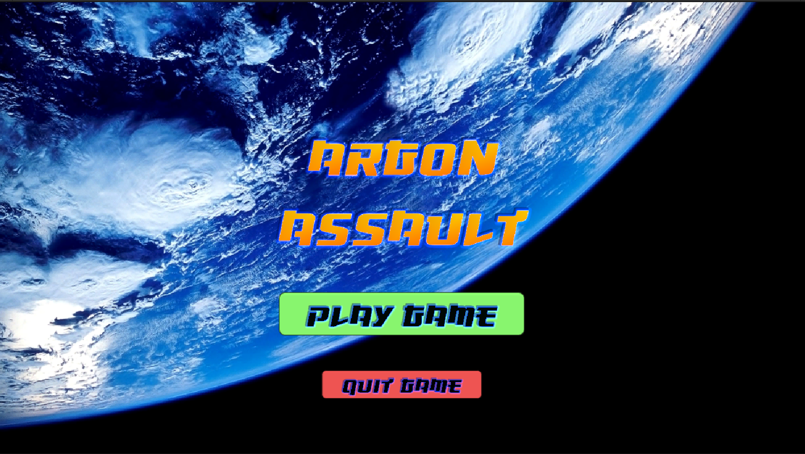
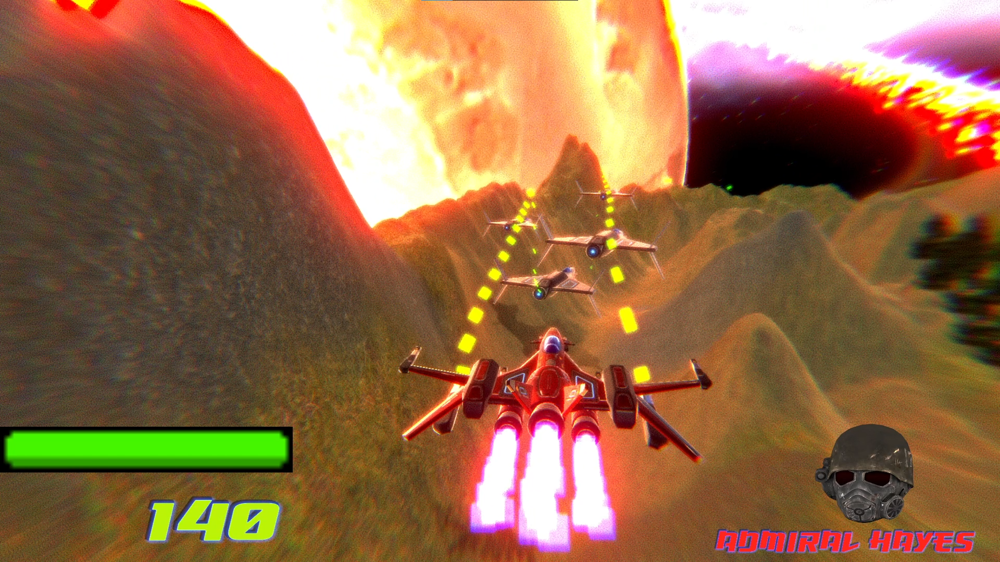
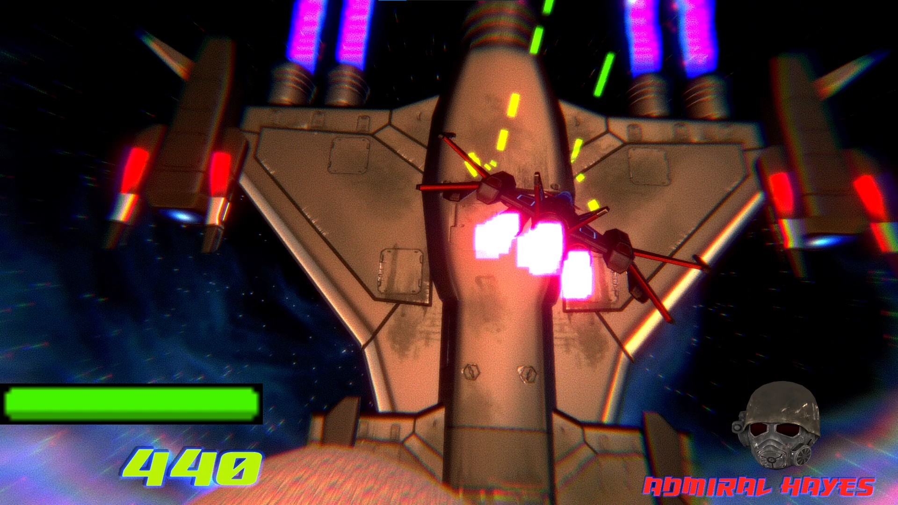
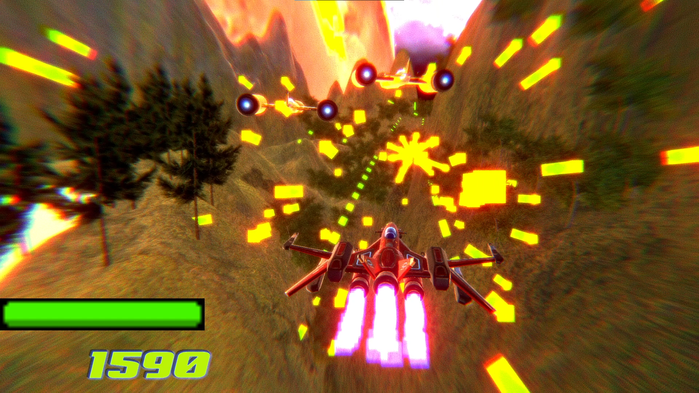
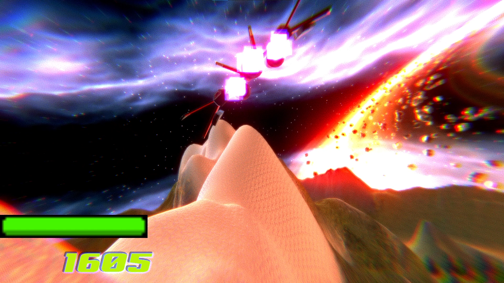
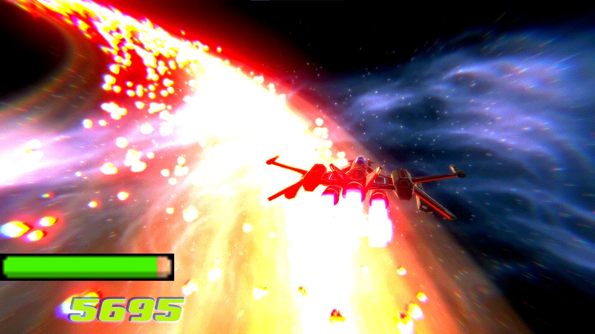
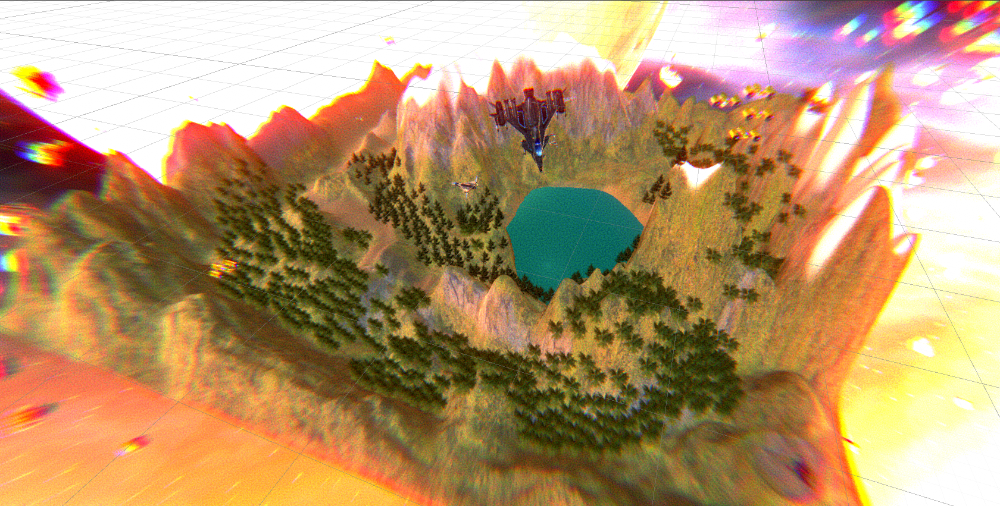

# Argon Assault

> Made in Unity 3D Course

Mini On-Rail Shooter Game

## Theme

You are trying to escape from Admiral Hayes and his army. Admiral Hayes is trying to chase you. While escaping, you also face Admiral Hayes.

## Gameplay

You are trying to escape Admiral Hayes and its army. General gameplay is that shoot as many enemies as you can and at the same time try to avoid obstacles.

## Play

[Play Argon Assault](https://sharemygame.com/@mustafaHTP/argon-assault)

If you have windows installed machine, you can try on your desktop, download [here](https://github.com/mustafaHTP/argon-assault/releases/tag/initial).

You can watch [gameplay video](https://youtu.be/xNdZZCtfgt4).

## Controls

**Move player** --> ``Arrows``, ``WSAD``, ``Gamepad/Xbox Controller Left Stick``

**Fire** --> ``Space``, ``Gamepad/Button South``, ``Xbox Controller/A``

**Main Menu** --> ``Escape``, ``Gamepad/Start``, ``Xbox Controller/Menu``

**Quit Game** --> ``Q``, ``Gamepad/Select``, ``Xbox Controller/View``

### Debug Keys

**Reload Scene** --> ``R``, ``Gamepad/Button North``, ``Xbox Controller/Y``

## Screenshots

---

---

---

---

---

---

---

---

## Clone Project

Project size ~ 1GB

Before cloning project, make sure you have enough internet quota and storage.

Thanks to [NotionTheory](https://github.com/NotionTheory) for [UnitySweeper](https://github.com/NotionTheory/unity-sweeper). I reduce 1GB project size thanks to it.
